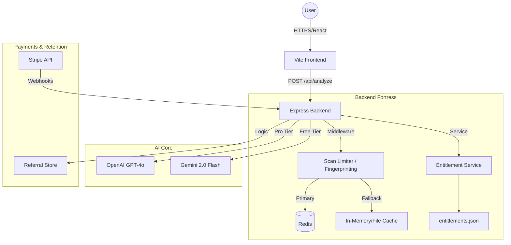

# 🤖 God-Mode Technical Handover: FitRate.app

This document is the "Source of Truth" for the FitRate.app ecosystem. It is structured for 100% technical fidelity, enabling an AI agent or senior engineer to understand the system architecture, security protocols, and business logic with zero ambiguity.

---

## 🏗️ 1. System Architecture (High-Level)



---

## 🔒 2. Security & Anti-Abuse (The Fortress)

### 2.1. Multi-Signal Fingerprinting
The backend generates a 32-char Sha256 hash (`generateFingerprint`) from **9 specific headers**:
1. `x-forwarded-for` (IP)
2. `user-agent`
3. `accept-language`
4. `accept-encoding`
5. `accept`
6. `connection`
7. `cache-control`
8. `sec-fetch-mode`
9. `sec-fetch-site`

**Abuse Detection Rules:**
- **Multi-Account**: >5 distinct `userId`s claiming the same fingerprint in 24h = Temporary Block.
- **Bot Filtering**: Rejection of short UAs (<20 chars) or known bot patterns (curl, wget, python, etc.).
- **Spam Block**: >5 invalid/non-outfit submissions = 24h block. Repeat offenders = 30-day "Permanent" ban.

### 2.2. AI-Layer Verification ("Fortress Prompt")
The AI (Gemini/OpenAI) is no longer a passive observer. Every call injects a `securityContext` block:
```json
{
  "user_id": "uuid",
  "auth_token_valid": boolean,
  "scans_used": integer,
  "daily_limit": integer,
  "referral_extras_earned": integer,
  "suspicious_flag": boolean
}
```
**AI Prime Directive**: If `scans_used >= daily_limit`, the AI MUST refuse to process and return a verbatim error message instead of an analysis. This prevents client-side "fake restart" exploits.

---

## 💰 3. Business Logic & Monetization

### 3.1. Tiers & Pricing
| Product | Price | Entitlement Granted |
| :--- | :--- | :--- |
| **Nice/Roast Scan** | Free | 1-2 per day (IP/FP limited) |
| **Pro Roast** | $0.99 | 1 Single "Savage" Analysis (OpenAI) |
| **Starter Pack** | $1.99 | +5 Permanent Scans |
| **Popular Pack** | $3.99 | +15 Permanent Scans |
| **Power Pack** | $9.99 | +50 Permanent Scans |
| **Pro Weekly** | $2.99/wk | 25 Scans/Day + Honest/Savage Modes |

### 3.2. Referral Loop (Arbitrage)
- **Reward**: Referrer gets **+1 Pro Roast** (OpenAI) per successful referral.
- **Cap**: Max 5 Pro Roasts via referrals.
- **Bonus**: Reaching 3 referrals auto-grants **+15 Free Scans** (Permanent).
- **Anti-Fraud**: Self-referral and same-device referral loops are blocked via Fingerprint mismatch.

---

## 🎨 4. Frontend & Render Engine

### 4.1. Result State Machine
1. `null` -> User arrives.
2. `capturing` -> Camera active.
3. `analyzing` -> Fake progress (0-90% in 10s) vs real API speed.
4. `result` -> Score count animation starts.
5. `share` -> Canvas renders the `ShareCard`.

### 4.2. Canvas Spec (`generateShareCard`)
- **Dimensions**: 1080x1920 (9:16) for Stories; 1080x1080 (1:1) for Feeds.
- **Layers**:
    1. Base Color (Black).
    2. User Photo (Aspect-filled, centered).
    3. Glassmorphism Overlay (Blur).
    4. Branding Seal ("FITRATE AI" letter-spaced 12px).
    5. Score Circle (Glow matched to score rank).
    6. **Golden Card**: Scores >= 95 trigger `#ffd700` pulsing gradient and "Style God" badge.
    7. **Pro Badge**: Gold banner for Pro status.

---

## 📊 5. Data Keys (Redis/Local)
- `fitrate:scans:FP:YYYY-MM-DD` -> Int (Count)
- `fitrate:pro:status:UserID|Email` -> "1" (Boolean)
- `fitrate:proroast:UserID` -> Int (Balance)
- `fitrate:referral:stats:UserID` -> JSON `{ proRoasts, totalReferrals, bonusScans }`
- `fitrate:invalid:FP` -> Int (Failure count)
- `entitlement:pro:Key` -> JSON metadata (Source, Expiry)

---

## 🤖 6. AI Handover Checklist
When taking over, verify:
1. `config.js` has both `GEMINI_API_KEY` and `OPENAI_API_KEY`.
2. Redis is reachable (`isRedisAvailable()`).
3. Stripe Webhook Secret is correctly mapped to `api/webhook`.
4. `index.css` contains the `.card-golden` animation classes.
5. `MASTER_PROMPT` in analyzers includes the security injection block.

---
**Verdict**: The system is designed for high-volume viral traffic with a robust defense-in-depth security model. Any interruption in Redis/AI availability is mitigated by durable local fallbacks and a multi-model fallback chain.
